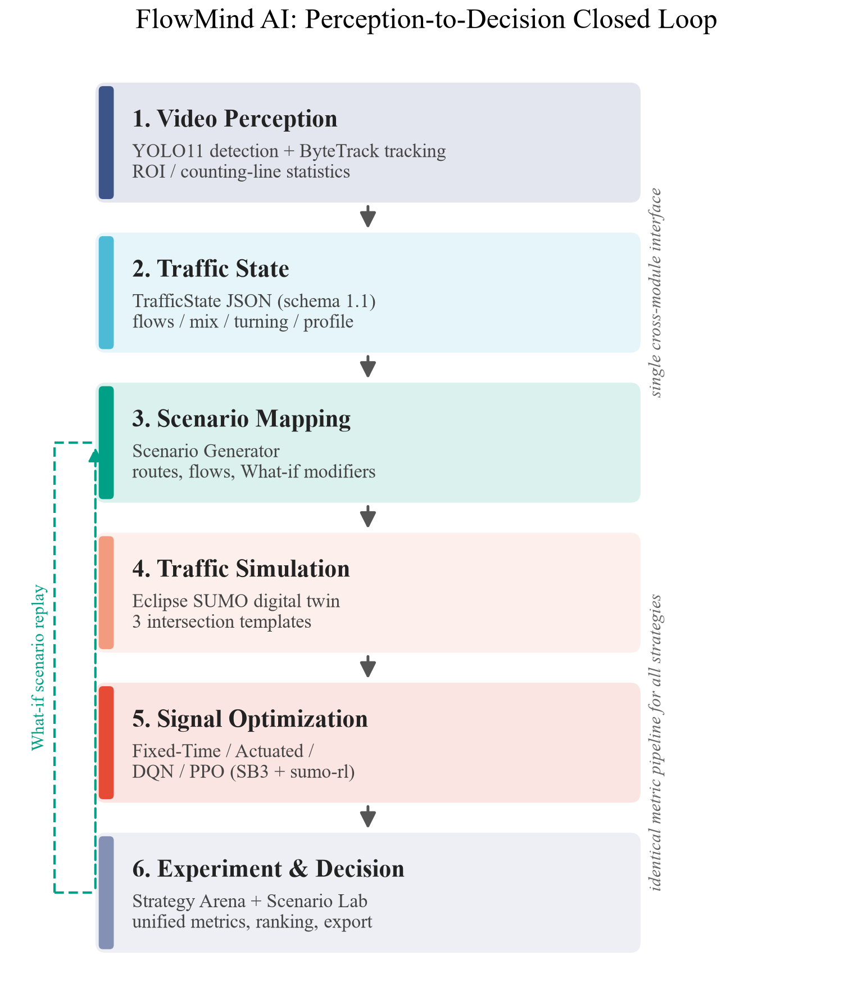

# FlowMind AI

基于视觉感知与数字孪生的城市交通智能推演与优化平台
（赛题三：面向科学、工程和社会科学的 "AI+X" 应用）

**核心闭环**：交通视频 → AI 车辆检测与跟踪 → TrafficState 交通状态 → SUMO 数字孪生 →
Fixed / Actuated / DQN / PPO 多策略信号控制 → 统一指标评估 → What-if 情景推演



## 功能模块

| 模块 | 内容 | 代码位置 |
|---|---|---|
| Traffic Vision | YOLO11 车辆检测 + ByteTrack 跟踪 + ROI/计数线四向统计 | `vision/` |
| Traffic State | 统一 TrafficState JSON 接口（系统唯一跨模块数据契约） | `docs/CONTRACTS.md` |
| Traffic Twin | 3 套 SUMO 路口模板 + TrafficState→route/flow 自动生成 | `simulation/` |
| Traffic Optimizer | Fixed-Time / Actuated / DQN / PPO 信号控制 | `optimization/` |
| Strategy Arena | 场景×策略×seed 批量实验 + 统一指标对比 | `experiments/` |
| Scenario Lab | 高峰 / 突发流量 / 车道封闭 What-if 推演 | `experiments/scenarios.py` |
| Dashboard | Streamlit 五页面可视化界面 | `app/` |

## 快速开始

### 1. 环境（Windows，Python 3.12，uv 管理）

```powershell
python -m uv venv .venv --python 3.12
python -m uv pip install --python .venv/Scripts/python.exe torch torchvision --index-url https://download.pytorch.org/whl/cu128
python -m uv pip install --python .venv/Scripts/python.exe -r requirements.txt
python -m uv pip install --python .venv/Scripts/python.exe libsumo==1.27.1
```

SUMO 由 pip 包 `eclipse-sumo` 提供，无需单独安装；`SUMO_HOME` 由
`simulation/sumo_home.py` 自动设置。

### 2. 端到端流水线（一条命令）

```powershell
.venv/Scripts/python.exe -m scripts.run_pipeline          # 完整：视频分析→基线→训练→批量实验→产图
.venv/Scripts/python.exe -m scripts.run_pipeline --quick  # 快速冒烟（短训练、单 seed）
```

### 3. 分步运行

```powershell
# 视频 → TrafficState
.venv/Scripts/python.exe -m vision.analyze --video data/videos/demo.mp4 --roi-config data/videos/demo_roi.json --state-out data/traffic_states/demo_001.json --annotated-video data/videos/demo_annotated.mp4 --figures-dir figures

# TrafficState → SUMO 路由
.venv/Scripts/python.exe -m simulation.route_generator --state data/traffic_states/demo_001.json --template cross_basic --out data/simulations/demo

# 单实验（场景×策略×seed）
.venv/Scripts/python.exe -m experiments.scenario_runner --scenario morning_peak --strategy fixed --seed 0

# 训练 RL
.venv/Scripts/python.exe -m optimization.train_dqn --template cross_basic --route data/simulations/demo/routes.rou.xml --timesteps 100000
.venv/Scripts/python.exe -m optimization.train_ppo --template cross_basic --route data/simulations/demo/routes.rou.xml --timesteps 100000

# 批量对比（Strategy Arena）+ 论文图
.venv/Scripts/python.exe -m experiments.strategy_compare --scenarios all --strategies fixed,actuated,dqn,ppo --seeds 3

# 界面
.venv/Scripts/python.exe -m streamlit run app/Home.py
```

## 统一指标（所有策略同一采集管线）

`avg_waiting_s`、`avg_travel_time_s`、`throughput_veh`、`avg_queue_veh`、
`max_queue_veh`、`avg_speed_mps`、`teleports` —— 定义见 `docs/CONTRACTS.md`。

## 目录结构

```
FlowMind/
├─ vision/           # 视频感知：检测/跟踪/计数 → TrafficState
├─ simulation/       # SUMO 模板、路由生成、仿真运行、指标
├─ optimization/     # RL 环境封装 + DQN/PPO 训练
├─ experiments/      # 场景库、批量实验、策略对比
├─ app/              # Streamlit 界面
├─ scripts/          # 论文图脚本 + sci_style + 流水线
├─ docs/             # CONTRACTS.md（接口契约）、DEVLOG.md（开发日志）
├─ data/             # videos / traffic_states / simulations / results
├─ models/           # YOLO 权重、RL checkpoint
└─ figures/          # 论文图（PNG, 300 DPI, Times New Roman, NPG 配色）
```

## 主要复用的开源项目

[Ultralytics](https://github.com/ultralytics/ultralytics)（YOLO11）·
[Supervision](https://github.com/roboflow/supervision)（ByteTrack/LineZone）·
[Eclipse SUMO](https://github.com/eclipse-sumo/sumo)（微观交通仿真）·
[sumo-rl](https://github.com/LucasAlegre/sumo-rl)（RL 环境封装）·
[Stable-Baselines3](https://github.com/DLR-RM/stable-baselines3)（DQN/PPO）

本项目不自研底层算法，创新点在系统级融合：视觉感知驱动的交通数字孪生、
多策略自主实验框架、面向交通变化的 What-if 智能推演。
