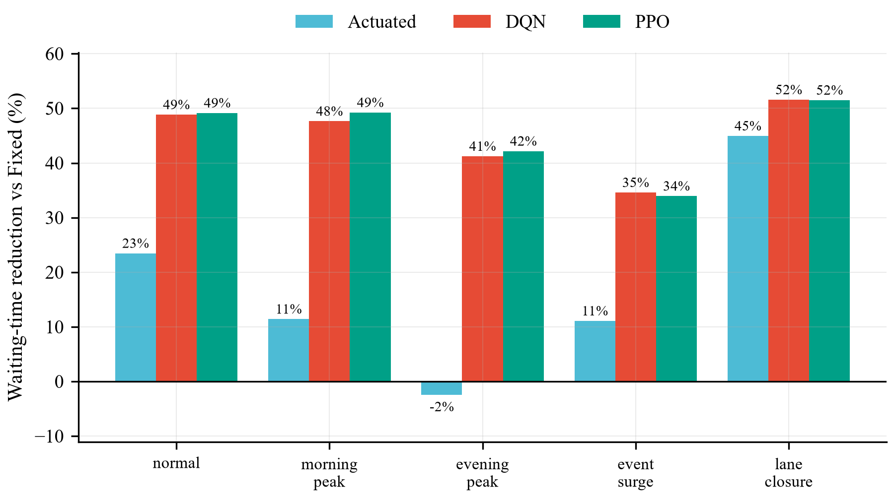

# FlowMind AI

基于视觉感知与数字孪生的城市交通智能推演与优化平台
（赛题三：面向科学、工程和社会科学的 "AI+X" 应用）

**核心闭环**：交通视频 → AI 车辆检测与跟踪 → TrafficState 交通状态 → SUMO 数字孪生 →
Fixed / Actuated / DQN / PPO 多策略信号控制 → 统一指标评估 → What-if 情景推演


## 功能模块

| 模块 | 内容 | 代码位置 |
|---|---|---|
| Traffic Vision | YOLO11 车辆检测 + ByteTrack 跟踪 + ROI/计数线四向统计 | `vision/` |
| Traffic State | 统一 TrafficState JSON 接口（系统唯一跨模块数据契约） | `docs/CONTRACTS.md` |
| Traffic Twin | 3 套 SUMO 路口模板 + TrafficState→route/flow 自动生成 | `simulation/` |
| Traffic Optimizer | Fixed-Time / Actuated / DQN / PPO 信号控制 | `optimization/` |
| Strategy Arena | 场景×策略×seed 批量实验 + 统一指标对比 | `experiments/` |
| Scenario Lab | 高峰 / 突发流量 / 车道封闭 What-if 推演 | `experiments/scenarios.py` |
| Dashboard | Streamlit 五页面可视化界面 | `app/` |

## 快速开始

### 1. 环境（Windows，Python 3.12，uv 管理）

```powershell
python -m uv venv .venv --python 3.12
python -m uv pip install --python .venv/Scripts/python.exe torch torchvision --index-url https://download.pytorch.org/whl/cu128
python -m uv pip install --python .venv/Scripts/python.exe -r requirements.txt
python -m uv pip install --python .venv/Scripts/python.exe libsumo==1.27.1
```

SUMO 由 pip 包 `eclipse-sumo` 提供，无需单独安装；`SUMO_HOME` 由
`simulation/sumo_home.py` 自动设置。

### 2. 端到端流水线（一条命令）

```powershell
.venv/Scripts/python.exe -m scripts.run_pipeline          # 完整：视频分析→基线→训练→批量实验→产图
.venv/Scripts/python.exe -m scripts.run_pipeline --quick  # 快速冒烟（短训练、单 seed）
```

### 3. 分步运行

```powershell
# 视频 → TrafficState
.venv/Scripts/python.exe -m vision.analyze --video data/videos/demo.mp4 --roi-config data/videos/demo_roi.json --state-out data/traffic_states/demo_001.json --annotated-video data/videos/demo_annotated.mp4 --figures-dir figures

# TrafficState → SUMO 路由
.venv/Scripts/python.exe -m simulation.route_generator --state data/traffic_states/demo_001.json --template cross_basic --out data/simulations/demo

# 单实验（场景×策略×seed）
.venv/Scripts/python.exe -m experiments.scenario_runner --scenario morning_peak --strategy fixed --seed 0

# 训练 RL
.venv/Scripts/python.exe -m optimization.train_dqn --template cross_basic --route data/simulations/demo/routes.rou.xml --timesteps 100000
.venv/Scripts/python.exe -m optimization.train_ppo --template cross_basic --route data/simulations/demo/routes.rou.xml --timesteps 100000

# 批量对比（Strategy Arena）+ 论文图
.venv/Scripts/python.exe -m experiments.strategy_compare --scenarios all --strategies fixed,actuated,dqn,ppo --seeds 3

# 界面
.venv/Scripts/python.exe -m streamlit run app/Home.py
```

## 统一指标（所有策略同一采集管线）

`avg_waiting_s`、`avg_travel_time_s`、`throughput_veh`、`avg_queue_veh`、
`max_queue_veh`、`avg_speed_mps`、`teleports` —— 定义见 `docs/CONTRACTS.md`。

指标对 RL 与基线用同一套 `MetricsCollector` + tripinfo，且都是**每仿真秒**采样一次。
每次实验会写 `run_meta.json` 记录输入指纹（base TrafficState / 路由 / checkpoint 的
sha1），`arena_summary.csv` 携带同样的 provenance 列 —— 不同输入产生的运行不会被拼进
同一张对比表（详见 `docs/DEVLOG.md` 2026-08-14 一节）。

## 实验结果

5 场景 × 4 策略 × 3 seed = **60 次实验**，每次 1800 s 仿真，全部基于同一份
base TrafficState（`data/traffic_states/demo_001.json`, sha1 `66940bea`）与同一套路由，
`cross_basic` 模板。下表为 60 次运行按策略聚合的均值±标准差（跨场景，故标准差同时含
场景间差异）：

| 策略 | avg_waiting_s | avg_travel_time_s | throughput_veh | avg_queue_veh | avg_speed_mps |
|---|---|---|---|---|---|
| Fixed-Time | 56.2 ± 4.1 | 102.9 ± 6.0 | 1203 ± 149 | 42.3 ± 6.0 | 4.8 ± 0.4 |
| Actuated | 46.1 ± 9.6 | **86.8 ± 9.3** | **1354 ± 58** | 40.8 ± 10.8 | **6.1 ± 0.8** |
| DQN | 31.2 ± 5.1 | 102.8 ± 13.0 | 1287 ± 76 | 22.7 ± 4.1 | 4.0 ± 0.5 |
| PPO | **30.9 ± 5.4** | 104.5 ± 13.5 | 1261 ± 83 | **22.0 ± 4.3** | 4.0 ± 0.5 |

各场景平均等待时间（s，3 seed 均值）：

| 场景 | Fixed | Actuated | DQN | PPO |
|---|---|---|---|---|
| normal | 52.9 | 40.5 | 27.0 | **26.9** |
| morning_peak | 50.9 | 45.1 | 26.6 | **25.8** |
| evening_peak | 56.9 | 58.3 | 33.4 | **32.9** |
| event_surge | 60.7 | 54.0 | **39.7** | 40.1 |
| lane_closure | 59.9 | 33.0 | 29.0 | 29.0 |



**怎么读这组结果**：

- RL 的优势集中在**等待时间与排队长度**：相对 Fixed-Time 降低 45%（PPO 30.9 s vs
  56.2 s），平均排队从 42 辆降到 22 辆（-48%），且在 5 个场景上一致；DQN 与 PPO 差距很小。
- 但 RL **不是全指标最优**。Actuated 的 throughput、行程时间、平均速度都最好；RL 的
  行程时间与 Fixed 基本持平（104.5 s vs 102.9 s），平均速度明显更低（4.0 vs 4.8 m/s）——
  RL 用"车辆缓行少停车"换掉了"停车久但通过快"，5 s 决策周期加 3 s 黄灯的频繁相位切换
  也会吃掉通行时间。要在论文里下"RL 更优"的结论必须指明是哪个指标。
- 两个 RL 模型只在 normal 需求上训练（100k steps），**泛化能力有限**：`event_surge`
  下 PPO 的 throughput 1260 低于 Fixed 的 1354，等待时间的相对收益也从 49% 掉到 34%。
- teleports 全场为 0，说明没有因为拥堵导致的车辆传送，指标可信。
- 需求来自 21.5 s 的 demo 视频外推，绝对量级仅供功能验证；结论的可比性来自"同一路由、
  同一采集管线"，而非真实路口标定。

## 测试

```powershell
.venv/Scripts/python.exe -m pytest -q                    # 全部（含 SUMO 用例）
.venv/Scripts/python.exe -m pytest -q -m "not sumo"      # 跳过需要真跑 SUMO 的用例
```

71 个回归测试，重点覆盖会"跑得通但结果错"的路径：路由必须按发车时间有序且需求覆盖整个
episode、实验缓存必须按输入指纹失效、对比表必须拒绝混来源的运行、界面排名必须裁剪到可比
子集。

## 目录结构

```
FlowMind/
├─ vision/           # 视频感知：检测/跟踪/计数 → TrafficState
├─ simulation/       # SUMO 模板、路由生成、仿真运行、指标
├─ optimization/     # RL 环境封装 + DQN/PPO 训练
├─ experiments/      # 场景库、批量实验、策略对比
├─ app/              # Streamlit 界面
├─ scripts/          # 论文图脚本 + sci_style + 流水线
├─ tests/            # pytest 回归测试（71 个）
├─ docs/             # CONTRACTS.md（接口契约）、DEVLOG.md（开发日志）
├─ data/             # videos / traffic_states / simulations / results
├─ models/           # YOLO 权重、RL checkpoint
└─ figures/          # 论文图（PNG, 300 DPI, Times New Roman, NPG 配色）
```

## 主要复用的开源项目

[Ultralytics](https://github.com/ultralytics/ultralytics)（YOLO11）·
[Supervision](https://github.com/roboflow/supervision)（ByteTrack/LineZone）·
[Eclipse SUMO](https://github.com/eclipse-sumo/sumo)（微观交通仿真）·
[sumo-rl](https://github.com/LucasAlegre/sumo-rl)（RL 环境封装）·
[Stable-Baselines3](https://github.com/DLR-RM/stable-baselines3)（DQN/PPO）

本项目不自研底层算法，创新点在系统级融合：视觉感知驱动的交通数字孪生、
多策略自主实验框架、面向交通变化的 What-if 智能推演。
